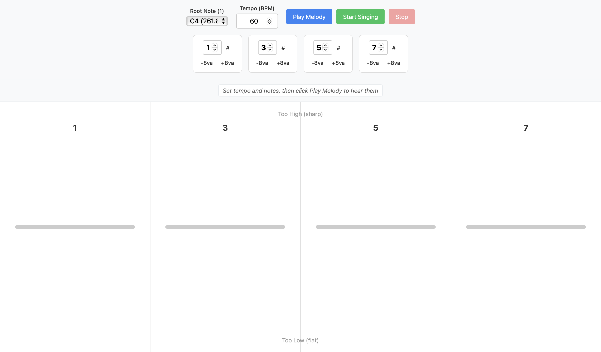

# vibe_pitch

Vibecoding a singing pitch webapp

A web app that helps you practice singing melodic patterns. Configure a 4-note melody using scale degrees, listen to it played back as piano tones, then sing it back and get visual feedback on your pitch accuracy for each note.



## Features

- **Melody Configuration**: Set up 4 notes using scale degrees (1-7) with optional sharps and octave shifts
- **Piano Playback**: Hear your melody played with realistic piano-like tones
- **Adjustable Tempo**: Set the metronome speed (BPM) for eighth notes
- **Countdown Timer**: 3-2-1 countdown at tempo before recording starts
- **Real-time Pitch Detection**: Uses your microphone to detect the pitch you're singing
- **Visual Feedback**: 4-column display shows your accuracy for each note
  - **Green (center)** = on pitch
  - **Red (moves up)** = too high
  - **Blue (moves down)** = too low

## Usage

### 1. Configure Your Melody

**Root Note (1):** Select the root note of your scale from the dropdown (e.g., C4). This becomes scale degree "1".

**Tempo (BPM):** Set the metronome speed. This controls how fast the notes play and how long you have to sing each note.

**Note Cards:** Configure each of the 4 notes:
- **Number (1-7):** The scale degree in a major scale
  - 1 = root
  - 2 = major 2nd
  - 3 = major 3rd
  - 4 = perfect 4th
  - 5 = perfect 5th
  - 6 = major 6th
  - 7 = major 7th
- **# (sharp):** Click to raise the note by one semitone
- **-8va:** Check to lower the note by one octave
- **+8va:** Check to raise the note by one octave

### 2. Listen to the Melody

Click **"Play Melody"** to hear your 4-note pattern played as piano tones. Listen carefully to memorize the pitches.

### 3. Sing the Melody

Click **"Start Singing"** to begin:
1. A **3-2-1 countdown** will appear (at your tempo speed)
2. Sing each note when its column highlights
3. The status bar shows which note you should be singing

### 4. Review Your Results

After all 4 notes, each column displays your average pitch accuracy:
- **Green line in center:** You sang the note accurately
- **Red line moved up:** You sang too high (sharp)
- **Blue line moved down:** You sang too low (flat)
- **Gray line:** No pitch was detected (sing louder!)

### Example Melodies to Try

| Pattern | Notes | Description |
|---------|-------|-------------|
| Major Arpeggio | 1, 3, 5, 8 | Classic major chord |
| Minor Feel | 1, 3#, 5, 7 | With raised 3rd |
| Octave Jump | 1, 5, 1 +8va, 5 | Practice octave leaps |
| Descending | 5, 3, 2, 1 | Coming back down |

## Requirements

- A modern web browser (Chrome, Firefox, Edge, or Safari)
- A microphone
- A local web server (see setup instructions below)

**Note:** Due to browser security restrictions, the microphone will only work when the page is served from `localhost` or `https://`. Opening the HTML file directly (`file://`) will not work.

## Setup Instructions

### Step 1: Clone the Repository

**All platforms (Mac/Linux/Windows):**

```bash
git clone https://github.com/holistudio/vibe_pitch.git
cd vibe_pitch
```

### Step 2: Start a Local Web Server

Choose ONE of the following options:

---

#### Option A: Using Python (Recommended for Mac/Linux)

**Mac/Linux:** Python 3 is usually pre-installed.

```bash
python3 -m http.server 8000
```

**Windows:** Python is not pre-installed. First install it from [python.org](https://www.python.org/downloads/), then:

```cmd
python -m http.server 8000
```

Then open: http://localhost:8000

---

#### Option B: Using Node.js/npm

First install Node.js from [nodejs.org](https://nodejs.org/) if you don't have it.

**All platforms:**

```bash
npx serve
```

Then open the URL shown (usually http://localhost:3000)

---

#### Option C: Using VS Code Live Server Extension

1. Install [Visual Studio Code](https://code.visualstudio.com/)
2. Install the "Live Server" extension by Ritwick Dey
3. Open the `vibe_pitch` folder in VS Code
4. Right-click on `index.html` and select "Open with Live Server"

---

### Step 3: Allow Microphone Access

When you click "Start Singing", your browser will ask for permission to use your microphone. Click "Allow" to enable pitch detection.

## Troubleshooting

**Microphone not working:**
- Make sure you're accessing via `localhost` (not `file://`)
- Check that your browser has microphone permissions enabled
- Try a different browser

**No pitch detected:**
- Sing louder or move closer to the microphone
- Make sure your microphone is not muted
- Check your system audio input settings
- Try a slower tempo to give yourself more time per note

**Notes sound wrong:**
- Verify your root note selection matches your vocal range
- Check that you haven't accidentally enabled sharps or octave shifts

**Page not loading:**
- Ensure the local server is running
- Check that you're using the correct port number in the URL
