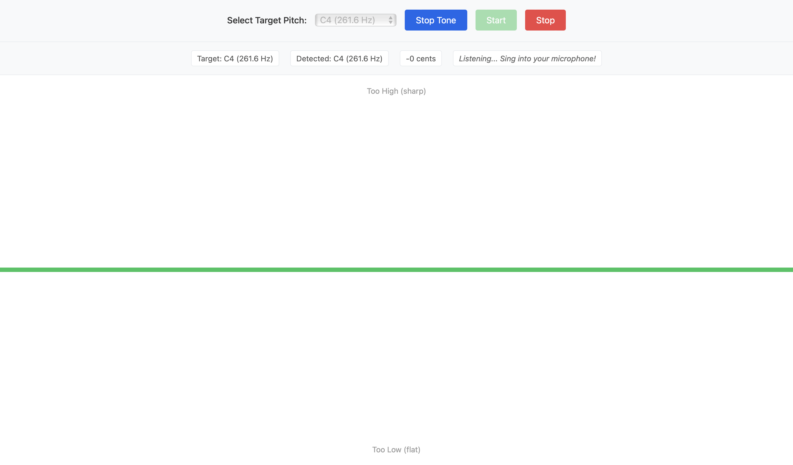

# vibe_pitch 🎤

Vibecoding a singing pitch webapp

Ever wondered if you're actually hitting that note, or just *think* you are? This web app gives you real-time visual feedback as you sing, so you can finally settle the debate with yourself.

Pick a note, sing into your mic, and watch the line tell you the truth!



## Features ✨

- **Wide vocal range** — Select any note from C2 to C6
- **Real-time pitch detection** — Instantly see how you're doing
- **Simple visual feedback** — A horizontal line shows your accuracy:
  - 🟢 **Green (center)** = Nailed it!
  - 🔴 **Red (moves up)** = Too high, bring it down
  - 🔵 **Blue (moves down)** = Too low, reach for it!
- **Play the target note** — Hear what you're aiming for with piano-like tones

## Requirements

- A modern web browser (Chrome, Firefox, Edge, or Safari)
- A microphone 🎙️
- A local web server (see instructions below)

**Note:** Due to browser security restrictions, the microphone only works when served from `localhost` or `https://`. Opening the HTML file directly won't work.

## Setup Instructions 🚀

### Step 1: Clone the Repository

**All platforms (Mac/Linux/Windows):**

```bash
git clone https://github.com/holistudio/vibe_pitch.git
cd vibe_pitch
```

### Step 2: Start a Local Web Server

Pick whichever option works for you:

---

#### Option A: Python (Recommended for Mac/Linux)

**Mac/Linux:** Python 3 is usually pre-installed.

```bash
python3 -m http.server 8000
```

**Windows:** Install Python from [python.org](https://www.python.org/downloads/) first, then:

```cmd
python -m http.server 8000
```

Then open: http://localhost:8000

---

#### Option B: Node.js/npm

Install Node.js from [nodejs.org](https://nodejs.org/) if needed.

```bash
npx serve
```

Then open the URL shown (usually http://localhost:3000)

---

#### Option C: VS Code Live Server

1. Install [Visual Studio Code](https://code.visualstudio.com/)
2. Install the "Live Server" extension by Ritwick Dey
3. Open the `vibe_pitch` folder in VS Code
4. Right-click `index.html` → "Open with Live Server"

---

### Step 3: Allow Microphone Access

When you click "Start", your browser will ask for mic permission. Click "Allow" and you're good to go!

## How to Use 🎵

1. **Pick your note** from the dropdown
2. **Click "Play Tone"** to hear the target pitch (optional but helpful!)
3. **Click "Start"** and allow microphone access
4. **Sing!** Watch the line:
   - Keep it green and centered = you're on pitch
   - Line going up + red = you're sharp, come down a bit
   - Line going down + blue = you're flat, push it higher
5. **Click "Stop"** when you're done

## Troubleshooting 🔧

**Microphone not working?**
- Make sure you're on `localhost` (not `file://`)
- Check browser permissions for microphone access
- Try a different browser

**No pitch detected?**
- Sing louder or get closer to the mic
- Check that your mic isn't muted
- Verify your system audio input settings

**Page won't load?**
- Make sure your local server is running
- Double-check the port number in your URL

---

Happy singing! 🎶
